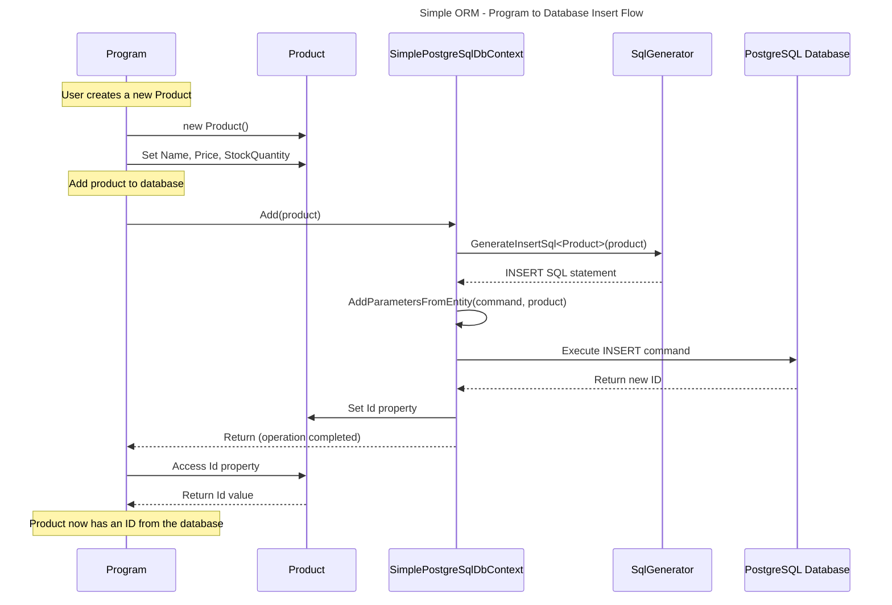

```mermaid
sequenceDiagram
    title Simple ORM - Program to Database Insert Flow
    
    participant Program
    participant Product
    participant SimplePostgreSqlDbContext
    participant SqlGenerator
    participant Database as PostgreSQL Database
    
    Note over Program: User creates a new Product
    Program->>Product: new Product()
    Program->>Product: Set Name, Price, StockQuantity
    
    Note over Program: Add product to database
    Program->>SimplePostgreSqlDbContext: Add(product)
    
    SimplePostgreSqlDbContext->>SqlGenerator: GenerateInsertSql<Product>(product)
    SqlGenerator-->>SimplePostgreSqlDbContext: INSERT SQL statement
    
    SimplePostgreSqlDbContext->>SimplePostgreSqlDbContext: AddParametersFromEntity(command, product)
    
    SimplePostgreSqlDbContext->>Database: Execute INSERT command
    Database-->>SimplePostgreSqlDbContext: Return new ID
    
    SimplePostgreSqlDbContext->>Product: Set Id property
    
    SimplePostgreSqlDbContext-->>Program: Return (operation completed)
    Program->>Product: Access Id property
    Product-->>Program: Return Id value
    
    Note over Program: Product now has an ID from the database
```